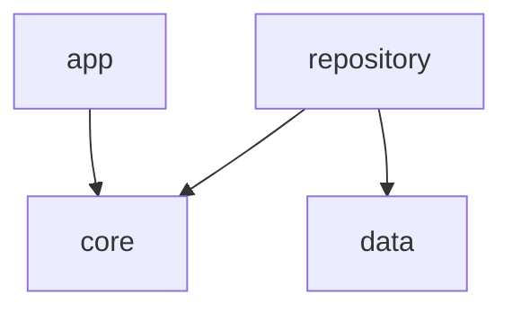
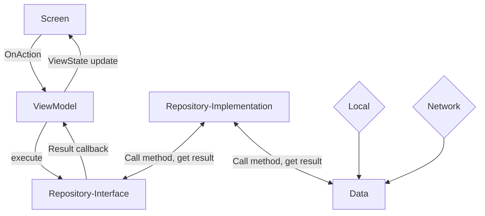

# AutoInspect

AutoScan is a mobile application designed to provide comprehensive vehicle history reports quickly and reliably. Whether you're a car buyer or enthusiast, AutoScan empowers you with detailed information to make informed decisions.

## Features

- **Fast & Reliable**: Get vehicle history reports quickly and reliably.
- **Basic Information**: Access essential details like registration, brand, model, and first registration date.
- **Technical Details**: Explore technical specifications including fiscal power, body type, and energy.
- **Vehicle Identification**: Identify vehicles accurately with VIN and engine code details.
- **Additional Information**: Find supplementary data such as the number of passengers and collection status.
- **Search Functionality**: Easily search for vehicles using their registration number.
- **Customization**: Tailor your experience with language and dark mode options.
- **Help & Support**: Access helpful resources, privacy policy, and terms of service.

## Getting Started

To get started with AutoScan, follow these steps:

 **Exploration**: Explore the app's features and functionalities.
 **Usage**: Enter a vehicle's registration number to view its history report.
 **Customization**: Customize your experience by selecting your preferred language and enabling dark mode.

## Support

For support, feedback, or inquiries, please contact our support team at support@autoscan.com.

## Contributing

We welcome contributions from the community! If you have any suggestions, bug reports, or feature requests, please submit them via GitHub Issues.

## License

This project is licensed under the [MIT License](LICENSE).

## Architecture

### Modules Dependency Flow

### Data Flow

Versions:
- Android Studio : Android Studio Giraffe | 2022.3.1 Patch 1
- Kotlin : 1.9.0
- Gradle : 8.1.1

